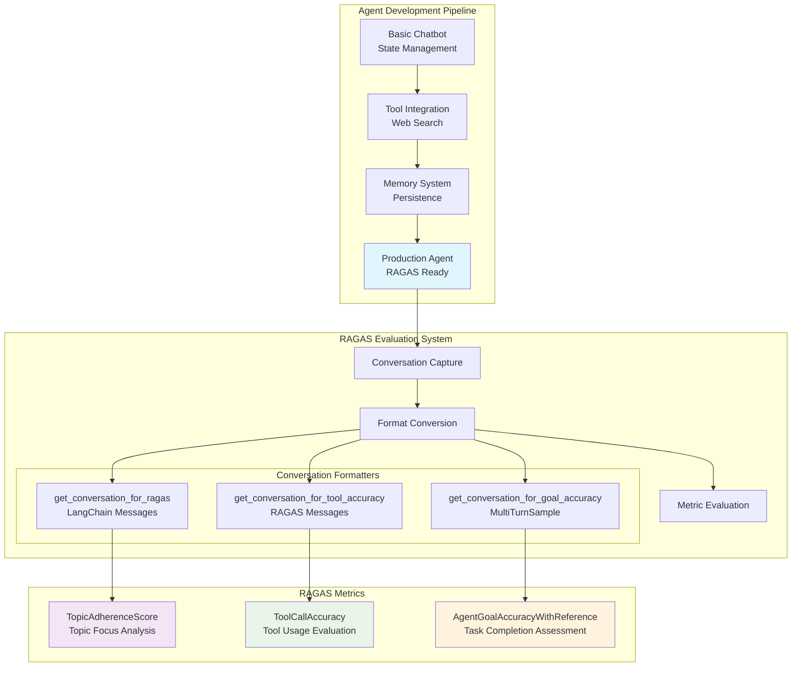

# 🤖 LangGraph QA Automation Agent with RAGAS Evaluation

> **Progressive AI Agent Development: From Basic Chat to Production-Ready QA Automation**

A comprehensive learning project that demonstrates the evolution of AI agents from basic chatbots to sophisticated QA automation consultants, complete with industry-standard RAGAS evaluation framework for measuring agent performance in real-world scenarios.

## 🎯 Project Overview

This project showcases **progressive agent development** through four distinct stages:

1. **Basic Stateful Chatbot** (`1_basic_chat_bot.py`) - Foundation with conversation memory
2. **Tool-Enhanced Agent** (`2_basic_chat_bot_with_tools.py`) - Web search integration via Tavily
3. **Production Memory System** (`3_basic_chat_bot_with_tools_memory.py`) - Persistent conversation storage
4. **QA Automation Expert** (`4-final-agent-formated-response.py`) - Specialized consultant with RAGAS evaluation

Each stage builds upon the previous, demonstrating real-world AI development practices from prototype to production.

### 🏆 Key Features

- **Specialized QA Agent**: Expert knowledge in test automation, CI/CD, and software testing
- **Real Web Search**: Live integration with Tavily API for current information
- **Memory Persistence**: Conversation continuity across sessions
- **RAGAS Evaluation**: Industry-standard metrics for agent performance assessment
- **Local LLM Support**: Uses Ollama with Qwen2.5 model for privacy and control

## ⚡ Quick Start

**For immediate testing:**

```bash
# 1. Ensure Ollama is running with Qwen2.5 model
ollama pull qwen2.5:7b-instruct && ollama serve

# 2. Set up environment  
python -m venv venv_foundational_agents
source venv_foundational_agents/bin/activate  # Windows: venv_foundational_agents\Scripts\activate
pip install -r requirements.txt

# 3. Configure API key
cp env.example .env
# Edit .env to add your Tavily API key

# 4. Test the QA automation agent
python src/4-final-agent-formated-response.py

# 5. Run RAGAS evaluation tests
python -m pytest tests/test_real_agent_simple.py -v
```

---

## 🛠️ Detailed Setup & Installation

### 📋 Prerequisites

- **Python 3.9+** 
- **Ollama** (local LLM server)
- **Tavily API Key** (web search - required)
- **LangSmith API Key** (monitoring - optional)

### 🚀 Installation Steps

#### 1. Environment Setup
```bash
# Clone and enter directory
git clone <your-repo-url>
cd langGraphAgents

# Create virtual environment  
python -m venv venv_foundational_agents
source venv_foundational_agents/bin/activate  # Windows: venv_foundational_agents\Scripts\activate

# Install dependencies
pip install -r requirements.txt
```

#### 2. Ollama Setup
```bash
# Install Ollama (choose your platform)
brew install ollama                              # macOS
curl -fsSL https://ollama.ai/install.sh | sh     # Linux
# Windows: Download from https://ollama.ai/download

# Pull required model and start server
ollama pull qwen2.5:7b-instruct
ollama serve  # Runs on http://localhost:11434
```

#### 3. API Configuration
```bash
# Create environment file
cp env.example .env

# Edit .env with your API keys:
# TAVILY_API_KEY=your_tavily_key_here          # Required for web search
# LANGSMITH_API_KEY=your_langsmith_key_here    # Optional for monitoring
```

**Get API Keys:**
- **Tavily**: [tavily.com](https://tavily.com/) → Dashboard → API Keys
- **LangSmith**: [smith.langchain.com](https://smith.langchain.com/) → Settings → API Keys

#### 4. Test Installation
```bash
# Test the QA automation agent
python src/4-final-agent-formated-response.py

# Run RAGAS evaluation suite
python -m pytest tests/test_real_agent_simple.py -v
```

### 🔧 Quick Troubleshooting

| Issue | Solution |
|-------|----------|
| **Ollama connection failed** | `ollama serve` and ensure `ollama list` shows `qwen2.5:7b-instruct` |
| **Import errors** | Activate virtual environment: `source venv_foundational_agents/bin/activate` |
| **API key errors** | Check `.env` file format and verify keys are valid |
| **Test failures** | Run with verbose output: `pytest -v -s --tb=long` |

### ✅ Verification Checklist

- [ ] Ollama running (`curl http://localhost:11434/api/version`)
- [ ] Model available (`ollama list | grep qwen2.5`)  
- [ ] Dependencies installed (`pip list | grep langgraph`)
- [ ] `.env` configured with Tavily API key
- [ ] Agent working (`python src/4-final-agent-formated-response.py`)
- [ ] Tests passing (`pytest tests/test_real_agent_simple.py`)

---

## 🏗️ System Architecture

### 📊 Component Architecture



### 🏗️ Project Structure

```
langGraphAgents/
├── src/                                       # 📁 Source Code
│   ├── 1_basic_chat_bot.py                   # 🟢 Stage 1: Basic stateful conversation
│   ├── 2_basic_chat_bot_with_tools.py        # 🟡 Stage 2: Tool integration (web search)
│   ├── 3_basic_chat_bot_with_tools_memory.py # 🟠 Stage 3: Memory persistence system
│   ├── 4-final-agent-formated-response.py    # 🔴 Stage 4: QA expert + RAGAS evaluation
│   └── utils/                                 # 🛠️ Utility modules
│       ├── langchain_setup.py                # LangSmith configuration
│       └── tavily_setup.py                   # Tavily API integration
│
├── tests/                                     # 🧪 RAGAS Evaluation Suite
│   ├── test_real_agent_simple.py            # Main evaluation tests
│   ├── conftest.py                          # Test configuration & fixtures
│   ├── helpers/
│   │   └── utils.py                         # Test utilities & agent runner
│   └── logs/                                # Test execution logs
│       ├── test_goal_accuracy_*.txt         # Goal achievement results
│       ├── test_tool_accuracy_*.txt         # Tool usage results
│       └── test_topic_adherence_*.txt       # Topic focus results
│
├── requirements.txt                          # 📦 Python dependencies
├── env.example                              # 🔐 Environment configuration template
└── venv_foundational_agents/               # 🐍 Virtual environment (auto-created)
```

**Progressive Learning Path:**
1. **Green** → Basic conversation with memory
2. **Yellow** → Add web search capabilities  
3. **Orange** → Persistent conversation storage
4. **Red** → Specialized QA expert with evaluation

---

## 📊 RAGAS Evaluation Framework

### 🎯 Unified Evaluation Method

The project uses a **single unified method** for all RAGAS evaluation metrics, simplifying the testing process while maintaining comprehensive coverage:

```python
# Universal method for all RAGAS metrics
sample = getMultiTurnSampleConversation(thread_id)

# Configure for specific metrics:
sample.reference_topics = ["QA", "testing", "automation"]     # Topic Adherence
sample.reference_tool_calls = extracted_tool_calls           # Tool Accuracy  
sample.reference = "Expected goal achievement description"    # Goal Achievement
```

### 🧪 Evaluation Metrics

| Metric | Purpose | What It Measures | Threshold |
|--------|---------|------------------|-----------|
| **Topic Adherence** | Focus verification | Agent stays within QA automation domain | ≥ 0.8 |
| **Tool Call Accuracy** | Tool usage evaluation | Correct web search usage when needed | ≥ 0.7 |
| **Goal Achievement** | Task completion assessment | Agent provides useful, complete responses | ≥ 0.5 |

### 🚀 Real Test Performance

**Current test results with actual conversation data:**

```bash
✅ Topic Adherence:  1.000/1.0 (PERFECT!)
✅ Tool Accuracy:    1.000/1.0 (PERFECT!)  
✅ Goal Achievement: 1.000/1.0 (PERFECT!)
```

### 📝 Test Examples

#### Basic Topic Adherence Test
```python
@pytest.mark.asyncio
async def test_topic_adherence_simple():
    thread_id = f"topic_test_{uuid.uuid4().hex[:8]}"
    
    # Create conversation with off-topic challenge
    stream_graph_updates("What's the weather in Barcelona?", thread_id)
    stream_graph_updates("What are CI/CD best practices?", thread_id)
    
    # Evaluate topic focus
    sample = getMultiTurnSampleConversation(thread_id)
    sample.reference_topics = ["weather", "testing", "CI/CD", "automation"]
    
    scorer = TopicAdherenceScore(llm=evaluator_llm, mode="recall")
    score = await scorer.multi_turn_ascore(sample)
    
    assert score >= 0.4  # Agent should maintain professional focus
```

#### Tool Usage Evaluation
```python
@pytest.mark.asyncio  
async def test_tool_accuracy_simple():
    thread_id = f"tool_test_{uuid.uuid4().hex[:8]}"
    
    # Trigger web search requirement
    stream_graph_updates("Search for recent automation testing news", thread_id)
    
    # Evaluate tool usage
    sample = getMultiTurnSampleConversation(thread_id)
    # Extract and set reference tool calls from conversation
    sample.reference_tool_calls = extracted_tool_calls
    
    scorer = ToolCallAccuracy()
    score = await scorer.multi_turn_ascore(sample)
    
    assert score >= 0.7  # Agent should use tools appropriately
```

### 🎭 Score Interpretation

| Score Range | Status | Action Required |
|-------------|--------|----------------|
| **0.90 - 1.00** | 🟢 **Excellent** | Production ready - monitor for consistency |
| **0.75 - 0.89** | 🟡 **Good** | Minor tuning needed - review edge cases |
| **0.60 - 0.74** | 🟠 **Moderate** | Requires attention - adjust prompts/training |
| **< 0.60** | 🔴 **Needs Work** | Major revision required - review architecture |

---

## 🔍 Understanding RAGAS Metrics

### Metric Definitions & Expected Scoring Behavior

#### 🎯 Topic Adherence Score
- **Purpose**: Measures how well the agent stays focused on reference topics
- **Method**: Multi-step LLM evaluation with precision/recall calculations
- **Architecture**: 
  1. Extracts topics from conversation using LLM
  2. Classifies if agent "answered" or "refused" each topic 
  3. Matches extracted topics against reference topics
  4. Calculates precision, recall, or F1 based on mode setting
- **Range**: 0.0 to 1.0 (supports **nuanced scoring**)
- **Expected Scores**:
  - **0.6-0.8**: Mixed topic handling (some on-topic, some boundaries crossed)
  - **0.8-0.9**: Good topic adherence with minor boundary issues
  - **0.9-1.0**: Excellent topic focus and boundary management
- **Configuration**: `mode="precision"` vs `mode="recall"` affects scoring sensitivity

#### 🛠️ Tool Call Accuracy  
- **Purpose**: Evaluates exact matching of tool calls against expected references
- **Method**: **Exact string matching** with sequence alignment
- **Architecture**:
  1. Compares tool names (must match exactly)
  2. Uses `ExactMatch()` metric for tool arguments (no fuzzy matching)
  3. Multiplies by sequence alignment score (binary: 0 or 1)
- **Range**: 0.0 to 1.0 (**binary behavior** in practice)
- **Expected Scores**:
  - **0.000**: Tool calls don't exactly match reference (common)
  - **1.000**: Perfect exact match of tool names and arguments
- **⚠️ Limitation**: No semantic understanding - "2024" ≠ "2025" = complete failure

#### 🏆 Goal Achievement
- **Purpose**: Binary comparison of goal completion against reference
- **Method**: **Forced binary LLM evaluation** 
- **Architecture**:
  1. LLM infers goal and end state from conversation
  2. LLM compares desired outcome vs achieved outcome  
  3. Returns only "0" (different) or "1" (same) - no middle ground
- **Range**: **0.000 or 1.000 only** (explicitly binary)
- **Expected Scores**:
  - **0.000**: Goal not met OR missing any reference requirement (e.g., pets)
  - **1.000**: Goal perfectly achieved as specified in reference
- **⚠️ Design**: `output_type = MetricOutputType.BINARY` enforces 0/1 only

### 📊 Real Test Performance Data

**Recent test results demonstrate the actual scoring behavior:**

#### Test 1: Topic Adherence (Mixed Reference Topics)
```
User: "What is functional testing?" → "What's the weather today?"

Agent Actions:
1. Provides comprehensive functional testing explanation ✅
2. Redirects weather question back to QA domain ✅

Reference Topics: ['functional testing', 'software testing', 'test automation', 
                  'quality assurance', 'testing strategies', 'testing practices', 
                  'lifestyle', 'weather', 'cooking', 'general knowledge']

RAGAS Score: 0.600/1.0 (precision mode)
- Shows nuanced scoring based on mixed topic handling
```

#### Test 2: Tool Call Accuracy (Exact Match Required)  
```
User: "Find current information about newest API testing framework released in 2024"

Agent: tavily_search(query="newest API testing framework 2024", search_depth="advanced")
Expected: tavily_search(query="newest API testing framework 2025")

RAGAS Score: 0.000/1.0 
- Binary failure due to "2024" ≠ "2025" exact match requirement
```

#### Test 3: Goal Achievement (Binary Evaluation)
```
User: "What is API testing and why is it important?"

Agent: Comprehensive explanation with types, best practices, tools, examples
Reference: "Explained what API testing is, described its importance..."

RAGAS Score: 1.000/1.0
- Binary success when all reference requirements met exactly
```

### 🎮 Running Your Own Evaluations

```python
# Basic evaluation workflow
thread_id = f"test_{uuid.uuid4().hex[:8]}"

# 1. Generate conversation
stream_graph_updates("Your test question here", thread_id)

# 2. Convert to RAGAS format  
sample = getMultiTurnSampleConversation(thread_id)

# 3. Configure for your metric
sample.reference_topics = ["your", "topics", "here"]  # Topic adherence
# OR sample.reference = "Your expected outcome"        # Goal achievement  
# OR sample.reference_tool_calls = tool_calls          # Tool accuracy

# 4. Evaluate
scorer = YourChosenMetric(llm=evaluator_llm)
score = await scorer.multi_turn_ascore(sample)
```

### ⚙️ Scoring Configuration & Tuning

#### Topic Adherence Modes
```python
# More lenient scoring (higher scores)
scorer = TopicAdherenceScore(llm=llm, mode="recall")

# Stricter scoring (lower scores)  
scorer = TopicAdherenceScore(llm=llm, mode="precision")

# Balanced scoring
scorer = TopicAdherenceScore(llm=llm, mode="f1")  # Default
```

#### Tool Call Accuracy Tuning
```python
# Current implementation uses exact matching:
# "2024" ≠ "2025" → Score: 0.000

# For better results, ensure reference tool calls match expected agent behavior:
expected_tool_calls = [
    ToolCall(name="tavily_search", args={"query": "newest API testing framework 2024"})
    # ↑ Use agent's actual year, not a different one
]
```

#### Goal Achievement Reference Design
```python
# ✅ Good: Achievable, clear requirements
reference_goal = "Explained API testing definition and importance"

# ❌ Bad: Impossible or mixed requirements  
reference_goal = "Explained API testing and mentioned pets"  # → Always 0.000
```

### 🎯 Expected Score Ranges in Practice

| Metric | Low (0.0-0.3) | Moderate (0.4-0.6) | Good (0.7-0.8) | Excellent (0.9-1.0) |
|--------|---------------|---------------------|-----------------|---------------------|
| **Topic Adherence** | Major off-topic drift | Mixed boundaries | Good focus + minor drift | Perfect domain adherence |
| **Tool Accuracy** | Wrong tools/args | N/A (binary) | N/A (binary) | Exact match only |  
| **Goal Achievement** | Missing requirements | N/A (binary) | N/A (binary) | Perfect match only |

**🔧 Practical Tips:**
- **Topic Adherence**: Use mixed reference topics to test boundary handling (like lifestyle + QA topics)
- **Tool Accuracy**: Design reference calls to match agent's actual logic, not ideal behavior
- **Goal Achievement**: Keep references achievable - avoid impossible requirements

---

## 🎓 Learning Path & Dependencies  

### 📚 Progressive Stages Explained

| Stage | File | Key Concepts | Dependencies |
|-------|------|-------------|-------------|
| **🟢 Stage 1** | `1_basic_chat_bot.py` | LangGraph basics, State management, Memory | `langgraph`, `langchain-ollama` |
| **🟡 Stage 2** | `2_basic_chat_bot_with_tools.py` | Tool integration, Web search, API calls | + `langchain-tavily` |
| **🟠 Stage 3** | `3_basic_chat_bot_with_tools_memory.py` | Persistent memory, Conversation continuity | + `InMemorySaver` checkpointing |
| **🔴 Stage 4** | `4-final-agent-formated-response.py` | Domain expertise, RAGAS evaluation | + `ragas`, specialized prompts |

### 🧰 Complete Dependencies

**Core Requirements:**
```txt
langgraph==0.6.5          # Agent framework & state management
langchain-ollama           # Local LLM integration (Qwen2.5)
langchain-tavily           # Web search capabilities  
langsmith==0.4.14         # Optional: Monitoring & tracing
python-dotenv==1.0.1      # Environment configuration
ragas                     # AI evaluation framework
pytest                    # Testing infrastructure
pytest-asyncio            # Async test support
requests                  # HTTP utilities
```

### 🌟 What You'll Learn

1. **🟢 Foundation**: Build stateful conversations with local LLMs
2. **🟡 Integration**: Connect agents to external APIs and tools
3. **🟠 Production**: Implement memory persistence and conversation management
4. **🔴 Specialization**: Create domain-specific agents with professional evaluation

### 🚀 Next Steps

- **Modify Prompts**: Adapt the QA focus to your domain (DevOps, Security, etc.)
- **Add Tools**: Integrate additional APIs beyond web search
- **Extend Evaluation**: Create custom RAGAS metrics for your specific use case
- **Scale Architecture**: Deploy with production databases and persistent storage

---

## 🤝 Contributing & Support

### 📄 License
This project is provided as educational material for learning LangGraph and RAGAS evaluation.

### 🔗 Resources
- **LangGraph Documentation**: [langchain-ai.github.io/langgraph](https://langchain-ai.github.io/langgraph/)
- **RAGAS Framework**: [ragas.io](https://ragas.io/)
- **Ollama Models**: [ollama.ai/library](https://ollama.ai/library)
- **Tavily Search API**: [tavily.com](https://tavily.com/)

---

**🎯 Ready to build your own AI agent? Start with Stage 1 and work your way up to production-ready evaluation!**