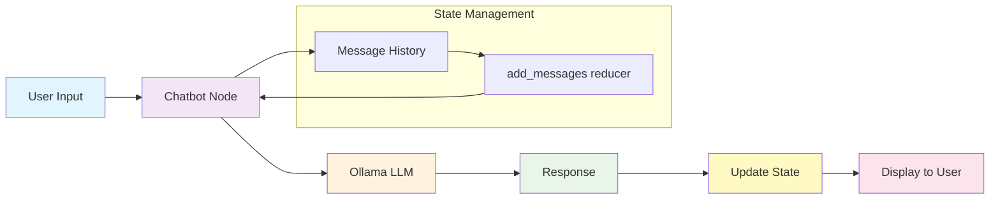
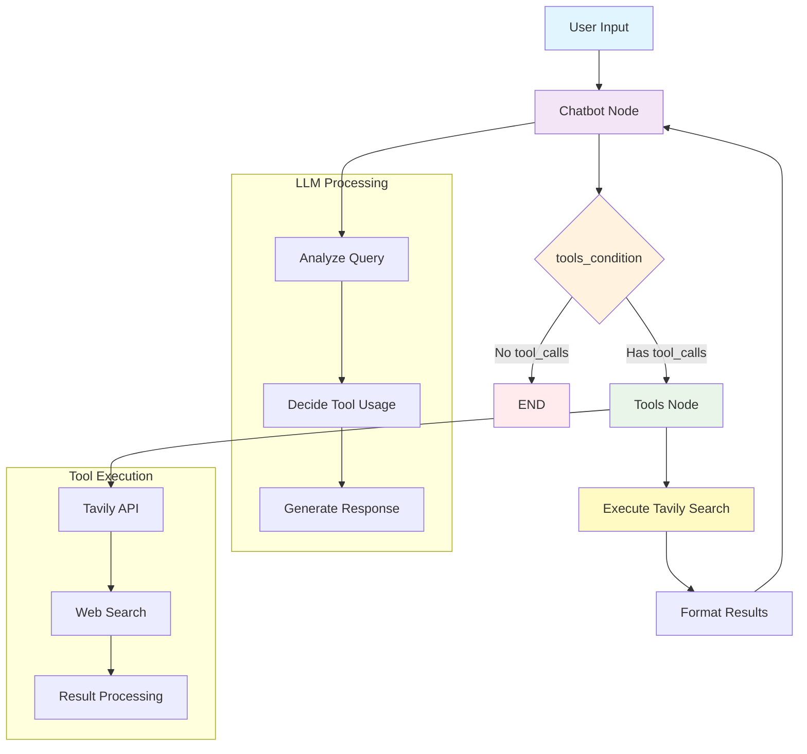

# LangGraph Agents Learning Project

A comprehensive tutorial project for building AI agents using LangChain and LangGraph, following the official tutorials with practical implementations.

## 🎯 Overview

This project demonstrates the progression from basic chatbots to advanced AI agents with tool integration:

- **LangChain** provides the foundational building blocks (LLMs, prompts, retrievers, agents) for AI applications
- **LangGraph** orchestrates these components as a graph, enabling stateful, multi-step, and controllable agent workflows

## 📚 Tutorials Implemented

| Tutorial | Script | Description |
|----------|--------|-------------|
| [Tutorial 1](https://langchain-ai.github.io/langgraph/tutorials/get-started/1-build-basic-chatbot/) | `src/1_basic_chat_bot.py` | Basic stateful chatbot |
| [Tutorial 2](https://langchain-ai.github.io/langgraph/tutorials/get-started/2-add-tools/) | `src/2_basic_chat_bot_with_tools.py` | Advanced chatbot with web search |

## 🚀 Quick Start

### Prerequisites

- Python 3.11+
- [Ollama](https://ollama.ai/) running locally with `qwen2.5:7b-instruct` model
- Optional: LangSmith API key for tracing
- Optional: Tavily API key for web search (Tutorial 2)

### Installation

1. **Create and activate virtual environment:**
   ```bash
   pyenv install 3.11
   pyenv shell 3.11
   python -m venv venv_foundational_agents
   source venv_foundational_agents/bin/activate
   ```

2. **Install dependencies:**
   ```bash
   pip install -r requirements.txt
   ```

3. **Configure environment (optional):**
   ```bash
   cp env.example .env
   # Edit .env with your API keys
   ```

### Quick Test

```bash
# Test basic chatbot
python src/1_basic_chat_bot.py

# Test advanced chatbot with tools
python src/2_basic_chat_bot_with_tools.py
```

## 📁 Project Structure

```
langGraphAgents/
├── src/
│   ├── 1_basic_chat_bot.py               # Tutorial 1: Basic stateful chatbot
│   ├── 2_basic_chat_bot_with_tools.py    # Tutorial 2: Chatbot with web search
│   └── utils/                            # Utility modules
│       ├── __init__.py
│       ├── langchain_setup.py            # LangChain/LangSmith configuration
│       └── tavily_setup.py               # Tavily search tool setup
├── env.example                           # Environment variables template
├── requirements.txt                      # Python dependencies
└── README.md                             # This file
```

## 🤖 Tutorial 1: Basic Chatbot

### Overview

The `src/1_basic_chat_bot.py` implements a foundational stateful chatbot using LangGraph that maintains conversation history and connects to a local Ollama model.

### Architecture Diagram



### Key Features

- **🔄 Stateful Conversations**: Maintains message history across interactions
- **📝 Message Accumulation**: Uses `add_messages` reducer to append (not overwrite) messages
- **🚀 Simple Architecture**: Linear flow from input to response
- **📊 LangSmith Integration**: Optional tracing for monitoring conversations

### Implementation Details

#### State Management
```python
class State(TypedDict):
    messages: Annotated[list, add_messages]
```
- **State**: TypedDict structure maintaining conversation history
- **add_messages**: Built-in reducer ensuring message accumulation (not replacement)

#### Core Components
```python
# LLM Configuration
llm = ChatOllama(
    model="qwen2.5:7b-instruct",
    base_url="http://localhost:11434",
    temperature=0.0,
)

# Graph Structure
graph_builder = StateGraph(State)
graph_builder.add_node("chatbot", chatbot)
graph_builder.add_edge(START, "chatbot")
graph_builder.add_edge("chatbot", END)
graph = graph_builder.compile()
```

#### Execution Flow
1. **User Input** → **Chatbot Node** → **Ollama LLM** → **Response Generation**
2. **State Update** → **Message History** → **Display Result**

### Usage Example

```bash
$ python src/1_basic_chat_bot.py
✅ Loaded environment variables from /path/to/.env
🔍 LangSmith tracing enabled for project: langgraphagents
User: Hello, how are you?
Assistant: Hello! I'm doing well, thank you for asking. I'm here and ready to help...

User: What can you help me with?
Assistant: I can assist you with a wide variety of tasks and questions...

User: quit
Goodbye!
```

## 🔧 Tutorial 2: Advanced Chatbot with Tools

### Overview

The `src/2_basic_chat_bot_with_tools.py` implements an advanced chatbot that can use external tools, specifically web search via Tavily, following the official LangGraph tutorial pattern.

### Architecture Diagram



### Key Features

- **🔍 Web Search Integration**: Uses Tavily API for real-time web searches
- **🤖 Intelligent Routing**: Automatically decides when to use tools
- **🔧 Prebuilt Components**: Uses LangGraph's optimized ToolNode and tools_condition
- **📊 Full Tracing**: LangSmith integration for monitoring tool usage
- **⚡ Graceful Fallback**: Works as basic chatbot if tools are unavailable

### Prebuilt Components Used

The implementation uses LangGraph's prebuilt components for simplicity and optimization:

#### 🔧 **ToolNode (Prebuilt)**
```python
from langgraph.prebuilt import ToolNode

tool_node = ToolNode(tools=tools)
graph_builder.add_node("tools", tool_node)
```

**What it does:**
- Executes tools requested by the LLM
- Handles parallel API execution for efficiency
- Automatically formats tool results as `ToolMessage`
- Replaces manual `BasicToolNode` implementation

**Manual equivalent:**
```python
class BasicToolNode:
    """A node that runs the tools requested in the last AIMessage."""
    def __init__(self, tools: list) -> None:
        self.tools_by_name = {tool.name: tool for tool in tools}
    
    def __call__(self, inputs: dict):
        # Custom logic to execute tools and format results
        ...
```

#### 🤖 **tools_condition (Prebuilt)**
```python
from langgraph.prebuilt import tools_condition

graph_builder.add_conditional_edges("chatbot", tools_condition)
```

**What it does:**
- Analyzes the last LLM message for tool calls
- Routes to "tools" node if tools are needed
- Routes to END if no tools are required
- Provides automatic decision-making logic

**Manual equivalent:**
```python
def route_tools(state):
    """Decide if we should use tools or end the conversation."""
    messages = state.get("messages", [])
    last_message = messages[-1]
    
    if hasattr(last_message, "tool_calls") and len(last_message.tool_calls) > 0:
        return "tools"  # Use tools
    return END          # End conversation
```

### Decision Flow

#### Step-by-Step Process:

1. **User asks**: "What's the weather today?"
2. **Chatbot node**: LLM processes input and determines it needs web search
3. **LLM generates**: `{"tool_calls": [{"name": "tavily_search", "args": {"query": "weather today"}}]}`
4. **tools_condition checks**: Sees `tool_calls` → returns `"tools"`
5. **Tools node**: Executes Tavily search and returns results
6. **Back to chatbot**: LLM processes search results
7. **LLM generates**: Final answer (no `tool_calls`)
8. **tools_condition checks**: No `tool_calls` → returns `END`
9. **Conversation ends**: User gets weather information

#### Example Scenarios:

**Scenario 1: Web Search Needed**
```
User: "Latest news about AI?"
→ Chatbot generates tool_calls
→ tools_condition → "tools"
→ Tavily search executes
→ Back to chatbot with results
→ Final response with current news
```

**Scenario 2: No Search Needed**
```
User: "What is 2+2?"
→ Chatbot answers directly (no tool_calls)
→ tools_condition → END
→ Simple math answer provided
```

### Benefits of Prebuilt Components

- ✅ **Less Code**: No need to implement routing logic manually
- ✅ **Optimized**: Parallel tool execution and error handling
- ✅ **Maintainable**: LangGraph updates improve functionality automatically
- ✅ **Standard**: Consistent behavior across different projects
- ✅ **Educational**: Still shows the graph construction pattern clearly

### Usage Example

```bash
$ python src/2_basic_chat_bot_with_tools.py
✅ Loaded environment variables from /path/to/.env
🔍 LangSmith tracing enabled for project: langgraphagents
🔍 Tavily API key configured: tvly-dev...
✅ Tavily search tool configured (max_results=2)
🔧 LLM configured with 1 tool(s)
✅ Graph compiled successfully

User: What are the latest updates in LangGraph 2025?
Assistant: [Performs web search via Tavily]
Based on the search results, here are some of the latest updates in LangGraph 2025:

### Node Caching (♻️)
LangChain introduced node/task level caching, which allows you to cache...

User: What is 2+2?
Assistant: 2+2 equals 4. This is a basic arithmetic operation.

User: quit
Goodbye!
```

## 🔧 Environment Configuration

### LangSmith Tracing (Optional)

For monitoring and debugging conversations:

1. **Copy the environment template:**
   ```bash
   cp env.example .env
   ```

2. **Edit the `.env` file with your API credentials:**
   ```bash
   # LangSmith Configuration (Optional - for tracing)
   LANGSMITH_TRACING=true
   LANGSMITH_API_KEY=your_langsmith_api_key_here
   LANGSMITH_PROJECT=langraph-chatbot
   LANGSMITH_ENDPOINT=https://api.smith.langchain.com
   
   # Tavily Configuration (Optional - for web search in tutorial 2)
   TAVILY_API_KEY=your_tavily_api_key_here
   ```

3. **Get your API keys:**
   - **LangSmith**: [smith.langchain.com](https://smith.langchain.com/) (for tracing)
   - **Tavily**: [tavily.com](https://tavily.com/) (for web search in tutorial 2)

### Environment Features

The setup automatically:
- ✅ Loads environment variables from `.env` file (if it exists)
- 🔧 Supports both `LANGSMITH_` and `LANGCHAIN_` variable prefixes
- 🔄 Maps LangSmith variables to LangChain tracing internally
- 🔍 Displays tracing status on startup
- 📊 Sends traces to LangSmith when configured
- ⚠️ Works normally without LangSmith (tracing disabled)

### Tavily Configuration

To enable web search capabilities:

1. **Get Tavily API Key**: Visit [tavily.com](https://tavily.com/) to get your API key
2. **Add to `.env`**: Include `TAVILY_API_KEY=your_api_key_here`
3. **Tool Status**: The script will show:
   - ✅ `Tavily search tool configured` if API key is valid
   - ⚠️ `TAVILY_API_KEY not found` if not configured

**Without Tavily**: The chatbot will still work but without web search capabilities.

## 📖 Learning Resources

- [LangGraph Concepts](https://langchain-ai.github.io/langgraph/concepts/why-langgraph/)
- [Tutorial 1: Build a Basic Chatbot](https://langchain-ai.github.io/langgraph/tutorials/get-started/1-build-basic-chatbot/)
- [Tutorial 2: Add Tools](https://langchain-ai.github.io/langgraph/tutorials/get-started/2-add-tools/)
- [LangSmith Documentation](https://docs.smith.langchain.com/)
- [Ollama Setup Guide](https://ollama.ai/)

## 🤝 Contributing

This project follows the official LangGraph tutorials. Contributions that improve clarity, add examples, or fix issues are welcome.

## 📄 License

This project is for educational purposes, following the MIT License.
