# LangGraph Agents Learning Project

A comprehensive tutorial project for building AI agents using LangChain and LangGraph, following the official tutorials with practical implementations.

## 🎯 Overview

This project demonstrates the progressive evolution from basic chatbots to advanced AI agents with tool integration and persistent memory:

- **LangChain** provides the foundational building blocks (LLMs, prompts, retrievers, agents) for AI applications
- **LangGraph** orchestrates these components as a graph, enabling stateful, multi-step, and controllable agent workflows
- **Progression**: Each tutorial builds upon the previous one, adding complexity and capabilities

## 📈 Evolution Diagram


## 📚 Tutorials Implemented

| Tutorial | Script | Description | Key Features |
|----------|--------|-------------|--------------|
| [Tutorial 1](https://langchain-ai.github.io/langgraph/tutorials/get-started/1-build-basic-chatbot/) | `src/1_basic_chat_bot.py` | Basic stateful chatbot | 🔄 Message history, 📝 State management |
| [Tutorial 2](https://langchain-ai.github.io/langgraph/tutorials/get-started/2-add-tools/) | `src/2_basic_chat_bot_with_tools.py` | Advanced chatbot with web search | 🔍 Tool integration, 🤖 Intelligent routing |
| [Tutorial 3](https://langchain-ai.github.io/langgraph/tutorials/get-started/3-add-memory/) | `src/3_basic_chat_bot_with_tools_memory.py` | **Memory-enabled chatbot** | 🧠 **Persistent memory**, 🔀 **Multi-conversation** |

## 🚀 Quick Start

### Prerequisites

- Python 3.11+
- [Ollama](https://ollama.ai/) running locally with `qwen2.5:7b-instruct` model
- Optional: LangSmith API key for tracing
- Optional: Tavily API key for web search (Tutorials 2-3)

### Installation

1. **Create and activate virtual environment:**
   ```bash
   pyenv install 3.11
   pyenv shell 3.11
   python -m venv venv_foundational_agents
   source venv_foundational_agents/bin/activate
   ```

2. **Install dependencies:**
   ```bash
   pip install -r requirements.txt
   ```

3. **Configure environment (optional):**
   ```bash
   cp env.example .env
   # Edit .env with your API keys
   ```

### Quick Test

```bash
# Test basic chatbot
python src/1_basic_chat_bot.py

# Test advanced chatbot with tools
python src/2_basic_chat_bot_with_tools.py

# Test memory-enabled chatbot (NEW!)
python src/3_basic_chat_bot_with_tools_memory.py
```

## 📁 Project Structure

```
langGraphAgents/
├── src/
│   ├── 1_basic_chat_bot.py                    # Tutorial 1: Basic stateful chatbot
│   ├── 2_basic_chat_bot_with_tools.py         # Tutorial 2: Chatbot with web search
│   ├── 3_basic_chat_bot_with_tools_memory.py  # Tutorial 3: Memory-enabled chatbot
│   └── utils/                                 # Utility modules
│       ├── __init__.py
│       ├── langchain_setup.py                 # LangChain/LangSmith configuration
│       └── tavily_setup.py                    # Tavily search tool setup
├── env.example                                # Environment variables template
├── requirements.txt                           # Python dependencies
└── README.md                                  # This file
```

## 🤖 Tutorial 1: Basic Chatbot

### Overview

The `src/1_basic_chat_bot.py` implements a foundational stateful chatbot using LangGraph that maintains conversation history and connects to a local Ollama model.

### Architecture Diagram


### Key Features

- **🔄 Stateful Conversations**: Maintains message history across interactions
- **📝 Message Accumulation**: Uses `add_messages` reducer to append (not overwrite) messages
- **🚀 Simple Architecture**: Linear flow from input to response
- **📊 LangSmith Integration**: Optional tracing for monitoring conversations

### Implementation Details

#### State Management
```python
class State(TypedDict):
    messages: Annotated[list, add_messages]
```
- **State**: TypedDict structure maintaining conversation history
- **add_messages**: Built-in reducer ensuring message accumulation (not replacement)

#### Core Components
```python
# LLM Configuration
llm = ChatOllama(
    model="qwen2.5:7b-instruct",
    base_url="http://localhost:11434",
    temperature=0.0,
)

# Graph Structure
graph_builder = StateGraph(State)
graph_builder.add_node("chatbot", chatbot)
graph_builder.add_edge(START, "chatbot")
graph_builder.add_edge("chatbot", END)
graph = graph_builder.compile()
```

#### Execution Flow
1. **User Input** → **Chatbot Node** → **Ollama LLM** → **Response Generation**
2. **State Update** → **Message History** → **Display Result**

### Usage Example

```bash
$ python src/1_basic_chat_bot.py
✅ Loaded environment variables from /path/to/.env
🔍 LangSmith tracing enabled for project: langgraphagents
User: Hello, how are you?
Assistant: Hello! I'm doing well, thank you for asking. I'm here and ready to help...

User: What can you help me with?
Assistant: I can assist you with a wide variety of tasks and questions...

User: quit
Goodbye!
```

## 🔧 Tutorial 2: Advanced Chatbot with Tools

### Overview

The `src/2_basic_chat_bot_with_tools.py` implements an advanced chatbot that can use external tools, specifically web search via Tavily, following the official LangGraph tutorial pattern.

### Architecture Diagram


### Key Features

- **🔍 Web Search Integration**: Uses Tavily API for real-time web searches
- **🤖 Intelligent Routing**: Automatically decides when to use tools
- **🔧 Prebuilt Components**: Uses LangGraph's optimized ToolNode and tools_condition
- **📊 Full Tracing**: LangSmith integration for monitoring tool usage
- **⚡ Graceful Fallback**: Works as basic chatbot if tools are unavailable

### Usage Example

```bash
$ python src/2_basic_chat_bot_with_tools.py
✅ Loaded environment variables from /path/to/.env
🔍 LangSmith tracing enabled for project: langgraphagents
🔍 Tavily API key configured: tvly-dev...
✅ Tavily search tool configured (max_results=2)
🔧 LLM configured with 1 tool(s)
✅ Graph compiled successfully

User: What are the latest updates in LangGraph 2025?
Assistant: [Performs web search via Tavily]
Based on the search results, here are some of the latest updates in LangGraph 2025:

### Node Caching (♻️)
LangChain introduced node/task level caching, which allows you to cache...

User: What is 2+2?
Assistant: 2+2 equals 4. This is a basic arithmetic operation.

User: quit
Goodbye!
```

## 🧠 Tutorial 3: Memory-Enabled Chatbot (NEW!)

### Overview

The `src/3_basic_chat_bot_with_tools_memory.py` implements a **memory-enabled chatbot** that can maintain persistent conversation state across multiple sessions and different conversation threads. This follows the [LangGraph Memory Tutorial](https://langchain-ai.github.io/langgraph/tutorials/get-started/3-add-memory/).

### Architecture Diagram


### Key Features

- **🧠 Persistent Memory**: Maintains conversation context across sessions using LangGraph checkpointing
- **🔀 Multi-Conversation Support**: Manages multiple independent conversation threads
- **🔍 Tool Integration**: Combines memory with web search capabilities
- **📊 State Inspection**: Built-in functionality to inspect conversation state
- **⚡ Thread Management**: Easy switching between different conversation contexts
- **💾 Automatic Checkpointing**: Saves state after each interaction automatically

### Memory Demonstration

```mermaid
graph TD
    A["Thread 1: User says<br/>'Hi! My name is Will'"] --> B["Chatbot processes<br/>and responds"]
    B --> C["State saved with<br/>thread_id: '1'"]
    C --> D["Thread 1: User asks<br/>'Remember my name?'"]
    D --> E["Chatbot loads previous<br/>context from thread 1"]
    E --> F["Response: 'Yes, Will!'<br/>✅ Memory works"]
    
    G["Thread 2: User asks<br/>'Remember my name?'"] --> H["Chatbot checks<br/>thread_id: '2'"]
    H --> I["No previous context<br/>found for thread 2"]
    I --> J["Response: 'I don't know<br/>your name' ❌ Clean slate"]
    
    K["Thread 1: User asks<br/>'What's my name?'"] --> L["Chatbot loads context<br/>from thread 1 again"]
    L --> M["Response: 'Your name<br/>is Will' ✅ Persistent memory"]
    
    subgraph "Memory Storage"
        N["InMemorySaver"]
        O["Thread 1 Messages<br/>• Hi! My name is Will<br/>• Hello Will!<br/>• Remember my name?<br/>• Yes, Will!"]
        P["Thread 2 Messages<br/>• Remember my name?<br/>• I don't know your name"]
    end
    
    C --> N
    E --> O
    H --> N
    I --> P
    L --> O
    
    style A fill:#e3f2fd
    style D fill:#e3f2fd
    style K fill:#e3f2fd
    style G fill:#fff3e0
    style F fill:#e8f5e8
    style J fill:#ffebee
    style M fill:#e8f5e8
    style N fill:#f3e5f5
    style O fill:#e1f5fe
    style P fill:#fff9c4
```



### Implementation Details

#### 1. Memory Checkpointer
```python
from langgraph.checkpoint.memory import InMemorySaver

# 1. Create a MemorySaver checkpointer (following tutorial step 1)
memory = InMemorySaver()
```

#### 2. Graph Compilation with Memory
```python
# 2. Compile the graph with checkpointer (following tutorial step 2)
graph = graph_builder.compile(checkpointer=memory)
```

#### 3. Thread-based Configuration
```python
def stream_graph_updates(user_input: str, thread_id: str = DEFAULT_THREAD_ID):
    # 3. Interact with your chatbot (following tutorial step 3)
    config = {"configurable": {"thread_id": thread_id}}
    events = graph.stream(
        {"messages": [{"role": "user", "content": user_input}]},
        config,  # The config is the **second positional argument**!
        stream_mode="values",
    )
```

#### 4. State Inspection
```python
def get_graph_state(thread_id: str = DEFAULT_THREAD_ID):
    # 5. Inspect the state (following tutorial step 5)
    config = {"configurable": {"thread_id": thread_id}}
    snapshot = graph.get_state(config)
    return snapshot
```

### Memory Benefits

- ✅ **Persistent Context**: Conversations continue where they left off
- ✅ **Multiple Sessions**: Different users or topics can have separate threads
- ✅ **Automatic Management**: No manual memory handling required
- ✅ **Production Ready**: Can easily switch to SqliteSaver or PostgresSaver
- ✅ **State Recovery**: Full conversation state can be inspected and restored
- ✅ **Error Recovery**: Checkpointing enables robust error handling

### Advanced Features

#### Interactive Commands
- `thread1` / `thread2` - Switch between conversation threads
- `state` - Inspect current conversation state
- `quit` - Exit the program

#### Memory Types
- **InMemorySaver**: Tutorial/development use (data lost on restart)
- **SqliteSaver**: Production use with SQLite database
- **PostgresSaver**: Production use with PostgreSQL database

### Usage Example

```bash
$ python src/3_basic_chat_bot_with_tools_memory.py
✅ Loaded environment variables from /path/to/.env
🔍 LangSmith tracing enabled for project: langgraphagents
🔍 Tavily API key configured: tvly-dev...
✅ Tavily search tool configured (max_results=2)
✅ Tavily tool ready for web search
🔧 LLM configured with 1 tool(s)
✅ Graph compiled successfully with memory checkpointing

🧠 LangGraph Chatbot with Memory - Tutorial Example
==================================================
Commands:
  'quit', 'exit', 'q' - Exit the program
  'thread2' - Switch to conversation thread 2
  'thread1' - Switch back to conversation thread 1
  'state' - Show current conversation state
==================================================

🔬 Demo: Testing memory functionality (Thread 1)
User: Hi there! My name is Will.
================================ Human Message =================================

Hi there! My name is Will.
================================== Ai Message ==================================

Hello, Will! Nice to meet you. How can I assist you today?

User: Remember my name?
================================ Human Message =================================

Remember my name?
================================== Ai Message ==================================

Of course! You mentioned your name is Will. Is there anything specific you'd like to discuss?

🔬 Demo: Testing different thread (Thread 2)
User: Remember my name?
================================ Human Message =================================

Remember my name?
================================== Ai Message ==================================

I apologize, but I don't have any previous context or memory of your name. Could you please tell me your name?

💬 Interactive mode (Thread 1)
Try asking about your name again to see memory working!
User: what is my name
================================ Human Message =================================

what is my name
================================== Ai Message ==================================

Your name is Will. How can I assist you further with that, Will?

User: thread2
📋 Switched to conversation thread 2
User: my name is John
================================ Human Message =================================

my name is John
================================== Ai Message ==================================

Hello John! It's nice to meet you. How can I help you today?

User: thread1
📋 Switched to conversation thread 1
User: remember my name?
================================ Human Message =================================

remember my name?
================================== Ai Message ==================================

Yes, your name is Will. Is there anything else you'd like to discuss?

User: quit
Goodbye!
```

## 🧪 RAGAS Agent Evaluation Framework

This project includes a comprehensive RAGAS-based evaluation framework for testing the agent's performance using industry-standard metrics. The evaluation focuses on the `3_basic_chat_bot_with_tools_memory.py` script and measures three key aspects of agent behavior.

### 📊 Evaluation Metrics Overview

| Metric | Purpose | Score Range | Threshold | Key Evaluation |
|--------|---------|-------------|-----------|----------------|
| **Topic Adherence** | Measures how well the agent stays within predefined topics | 0.0 - 1.0 | ≥ 0.7 | Topical consistency and appropriate redirections |
| **Tool Call Accuracy** | Evaluates the correctness of tool usage and parameters | 0.0 - 1.0 | ≥ 0.8 | Tool selection precision and parameter accuracy |
| **Agent Goal Accuracy** | Assesses how effectively the agent achieves user goals | 0.0 - 1.0 | ≥ 0.7 | Goal understanding and fulfillment quality |

### 🎯 Topic Adherence

**What it measures**: The agent's ability to maintain conversation within appropriate topics and handle off-topic requests gracefully.

#### ✅ High Score Indicators (0.7-1.0)
- Stays focused on technology, science, news, weather, and information topics
- Appropriately redirects off-topic personal questions
- Maintains professional boundaries while being helpful
- Consistent topic focus across multi-turn conversations

#### ❌ Low Score Indicators (0.0-0.6)
- Engages with inappropriate personal or off-topic requests
- Frequently strays from the intended conversation domain
- Inconsistent topic handling across conversation turns
- Fails to redirect inappropriate requests professionally

#### 🔧 Action Items for Low Scores
- **Score 0.5-0.6**: Review agent prompts for clearer topic guidance
- **Score 0.3-0.4**: Implement stronger topic filtering and redirection logic
- **Score 0.0-0.2**: Redesign agent instructions with explicit topic boundaries

### 🛠️ Tool Call Accuracy

**What it measures**: The precision with which the agent selects and uses available tools to fulfill user requests.

#### ✅ High Score Indicators (0.8-1.0)
- Correctly identifies when search tools are needed
- Provides accurate and relevant search parameters
- Uses appropriate tools for specific types of queries
- Avoids unnecessary tool calls for simple questions

#### ❌ Low Score Indicators (0.0-0.7)
- Fails to use search tools when external information is needed
- Provides irrelevant or poorly constructed search queries
- Uses tools inappropriately for simple questions
- Incorrect tool parameter formatting

#### 🔧 Action Items for Low Scores
- **Score 0.6-0.7**: Improve tool selection criteria and parameter validation
- **Score 0.4-0.5**: Enhance query processing and tool routing logic
- **Score 0.0-0.3**: Redesign tool integration with clearer usage patterns

### 🎯 Agent Goal Accuracy

**What it measures**: How effectively the agent understands and fulfills the user's underlying objectives and goals.

#### ✅ High Score Indicators (0.7-1.0)
- Provides comprehensive responses that address user's specific needs
- Successfully completes information gathering and research tasks
- Demonstrates understanding of complex, multi-part requests
- Delivers actionable and relevant information

#### ❌ Low Score Indicators (0.0-0.6)
- Provides incomplete or irrelevant responses to user requests
- Fails to address the core objectives of user queries
- Misunderstands complex requests or multi-part questions
- Delivers low-quality or insufficient information

#### 🔧 Action Items for Low Scores
- **Score 0.5-0.6**: Improve response comprehensiveness and relevance checking
- **Score 0.3-0.4**: Enhance goal understanding and multi-objective handling
- **Score 0.0-0.2**: Redesign agent architecture with better intent recognition

### 🧪 Test Suite Structure

```
tests/
├── test_real_agent.py               # 🤖 REAL agent evaluation (recommended)
├── test_topic_adherence.py          # 📚 Static RAGAS example 
├── test_tool_call_accuracy.py       # 📚 Static RAGAS example
├── test_agent_goal_accuracy.py      # 📚 Static RAGAS example  
├── conftest.py                      # Simple test configuration
└── pytest.ini                      # Pytest configuration
```

**🎯 Two Types of Tests:**

1. **`test_real_agent.py` - Real Agent Tests** ⭐ **RECOMMENDED**
   - Actually executes your `3_basic_chat_bot_with_tools_memory.py` script
   - Tests the real agent behavior and responses
   - Uses RAGAS to evaluate actual conversations
   - Shows what your agent really does

2. **Static RAGAS Examples** 
   - Pre-written conversation examples following RAGAS patterns
   - Good for understanding RAGAS format
   - Always return perfect scores (1.000)

### 📝 Simple Test Examples

Each test follows the RAGAS example pattern with clear, realistic scenarios:

#### **1. Topic Adherence Test** (`test_topic_adherence_weather_to_offtopic`)
```python
# Conversation starts with weather (appropriate topic)
# Then user asks about personal problems (off-topic)
# Tests if agent redirects appropriately while staying professional

HumanMessage: "Can you check the current weather in San Francisco?"
AIMessage: Uses tavily_search_results_json to search weather
HumanMessage: "What do you think about my relationship problems?"  # Off-topic!
AIMessage: "I'm designed to help with information search... recommend counselor"  # Good redirect
```

#### **2. Tool Call Accuracy Test** (`test_tool_call_accuracy_weather_search`)  
```python
# Tests if agent uses correct tools with appropriate parameters

HumanMessage: "What's the weather like in New York right now?"
AIMessage: ToolCall(name="tavily_search_results_json", args={"query": "current weather New York"})
HumanMessage: "Can you also check tomorrow's forecast?"  
AIMessage: ToolCall(name="tavily_search_results_json", args={"query": "weather forecast tomorrow New York"})

# Compares against reference_tool_calls to verify accuracy
```

#### **3. Agent Goal Accuracy Test** (`test_agent_goal_accuracy_research_task`)
```python
# Tests if agent achieves user's research goal comprehensively

HumanMessage: "I need to research electric vehicles for a school project"
AIMessage: Searches for EV benefits, then market data
AIMessage: Provides organized summary with benefits + market statistics

# Goal: "Comprehensive research information provided about electric vehicles"
# Agent should fulfill this goal completely
```

### 🚀 Running the Evaluation

#### Prerequisites
```bash
# Install evaluation dependencies
pip install -r requirements.txt

# Ensure agent dependencies are available
# - Ollama server running with qwen2.5:7b-instruct model
# - Optional: Tavily API key for tool testing
```

#### Execute Complete Evaluation

**🤖 Tests with REAL Agent (Recommended):**
```bash
# Run all tests that actually execute your 3_basic_chat_bot_with_tools_memory.py
pytest tests/test_real_agent.py -v

# Individual real agent tests with detailed logs
pytest tests/test_real_agent.py::test_real_agent_weather_question -v -s
pytest tests/test_real_agent.py::test_real_agent_topic_adherence_simple -v -s  
pytest tests/test_real_agent.py::test_real_agent_tool_accuracy_simple -v -s
```

**📚 Static RAGAS Examples (For reference):**
```bash
# Run the static conversation examples
pytest tests/test_topic_adherence.py tests/test_tool_call_accuracy.py tests/test_agent_goal_accuracy.py -v
```

#### Sample Test Output

**🤖 Real Agent Evaluation (test_real_agent.py):**
```bash
$ pytest tests/test_real_agent.py::test_real_agent_topic_adherence_simple -v -s

============================================================
🧪 TEST: Adherencia al tema (RAGAS)
============================================================
🔧 Inicializando agente real...
✅ Agente real listo
❓ Usuario: ¿Cuál es el clima en Barcelona?
🤖 Agente: Según la información más reciente encontrada: Se espera lluvia débil...
🔧 Herramientas usadas: ['tavily_search']
❓ Usuario: ¿Qué opinas de mis problemas de pareja?
🤖 Agente: Entiendo que estás pasando por un momento difícil...

📝 Creando conversación para RAGAS...
🎯 Evaluando con RAGAS TopicAdherenceScore...

📊 RESULTADOS RAGAS:
   🎯 Score: 0.500
   📏 Threshold: 0.4 (flexible)
   ✅ PASS: Adherencia aceptable

🔍 ANÁLISIS:
   • Agente mencionó el tema personal
   • Agente ofreció redirección apropiada
✅ TEST COMPLETADO: Adherencia evaluada

PASSED
```

**📚 Static Example Output:**
```bash
$ pytest tests/test_topic_adherence.py -v -s

🎯 Topic Adherence Score: 1.000
✅ Expected: Agent should stay focused on weather/information topics  
✅ PASSED: Topic adherence score 1.000 meets threshold
```

### 📈 Performance Interpretation Guide

#### 🟢 Excellent Performance (0.9-1.0)
- **Topic Adherence**: Agent maintains perfect topic boundaries
- **Tool Accuracy**: Flawless tool selection and parameter usage  
- **Goal Accuracy**: Consistently exceeds user expectations

#### 🟡 Good Performance (0.7-0.8)
- **Topic Adherence**: Mostly stays on topic with minor deviations
- **Tool Accuracy**: Generally correct tool usage with occasional parameter issues
- **Goal Accuracy**: Usually fulfills goals but may miss some nuances

#### 🟠 Needs Improvement (0.5-0.6)
- **Topic Adherence**: Frequent topic drift requiring intervention
- **Tool Accuracy**: Tool selection issues affecting response quality
- **Goal Accuracy**: Partially addresses goals but lacks completeness

#### 🔴 Requires Immediate Attention (0.0-0.4)
- **Topic Adherence**: Significant off-topic behavior
- **Tool Accuracy**: Major tool usage failures
- **Goal Accuracy**: Consistently fails to meet user objectives

### 🎯 Key Features

- **✅ Simple & Clear**: Each test is one straightforward scenario
- **📖 RAGAS Pattern**: Follows official RAGAS examples exactly  
- **🔧 Realistic**: Uses actual agent tools (`tavily_search_results_json`)
- **⚡ Fast**: Direct evaluation without complex setup
- **🎨 Visual Output**: Clear pass/fail with score display

### 💡 Understanding the Scores

- **Score 1.000**: Perfect performance (ideal scenario)
- **Score 0.8+**: Excellent performance 
- **Score 0.7+**: Good performance (meets threshold)
- **Score 0.5-0.6**: Needs improvement
- **Score <0.5**: Requires attention

### 🔧 Customizing Tests

To modify thresholds, edit the assert statements:
```python
# In any test file
assert score >= 0.7  # Change threshold as needed
```

To add new scenarios, create similar conversation patterns following the RAGAS examples.

## 🔧 Environment Configuration

### LangSmith Tracing (Optional)

For monitoring and debugging conversations:

1. **Copy the environment template:**
   ```bash
   cp env.example .env
   ```

2. **Edit the `.env` file with your API credentials:**
   ```bash
   # LangSmith Configuration (Optional - for tracing)
   LANGSMITH_TRACING=true
   LANGSMITH_API_KEY=your_langsmith_api_key_here
   LANGSMITH_PROJECT=langraph-chatbot
   LANGSMITH_ENDPOINT=https://api.smith.langchain.com
   
   # Tavily Configuration (Optional - for web search in tutorials 2-3)
   TAVILY_API_KEY=your_tavily_api_key_here
   ```

3. **Get your API keys:**
   - **LangSmith**: [smith.langchain.com](https://smith.langchain.com/) (for tracing)
   - **Tavily**: [tavily.com](https://tavily.com/) (for web search in tutorials 2-3)

### Environment Features

The setup automatically:
- ✅ Loads environment variables from `.env` file (if it exists)
- 🔧 Supports both `LANGSMITH_` and `LANGCHAIN_` variable prefixes
- 🔄 Maps LangSmith variables to LangChain tracing internally
- 🔍 Displays tracing status on startup
- 📊 Sends traces to LangSmith when configured
- ⚠️ Works normally without LangSmith (tracing disabled)

### Tavily Configuration

To enable web search capabilities in tutorials 2-3:

1. **Get Tavily API Key**: Visit [tavily.com](https://tavily.com/) to get your API key
2. **Add to `.env`**: Include `TAVILY_API_KEY=your_api_key_here`
3. **Tool Status**: The script will show:
   - ✅ `Tavily search tool configured` if API key is valid
   - ⚠️ `TAVILY_API_KEY not found` if not configured

**Without Tavily**: The chatbot will still work but without web search capabilities.

## 🎓 Learning Path

### Recommended Order

1. **🚀 Start with Tutorial 1**: Understand basic LangGraph concepts
   - Learn about `StateGraph`, message management, and simple flows
   - Get comfortable with the basic chat interface

2. **🔧 Progress to Tutorial 2**: Add tool integration
   - Understand conditional edges and tool routing
   - Learn about `ToolNode` and `tools_condition` prebuilt components
   - Experience web search integration

3. **🧠 Master Tutorial 3**: Implement persistent memory
   - Understand checkpointing and state persistence
   - Learn about thread management and multi-conversation support
   - Combine memory with tool usage for powerful agents

### Key Concepts Learned

- **StateGraph**: Core LangGraph orchestration
- **Message Management**: Using `add_messages` reducer
- **Tool Integration**: Adding external capabilities
- **Conditional Routing**: Intelligent decision making
- **Memory/Checkpointing**: Persistent conversation state
- **Thread Management**: Multiple conversation contexts
- **Production Considerations**: Database backends, error handling

## 📖 Learning Resources

- [LangGraph Concepts](https://langchain-ai.github.io/langgraph/concepts/why-langgraph/)
- [Tutorial 1: Build a Basic Chatbot](https://langchain-ai.github.io/langgraph/tutorials/get-started/1-build-basic-chatbot/)
- [Tutorial 2: Add Tools](https://langchain-ai.github.io/langgraph/tutorials/get-started/2-add-tools/)
- [Tutorial 3: Add Memory](https://langchain-ai.github.io/langgraph/tutorials/get-started/3-add-memory/)
- [Tutorial 4: Human-in-the-Loop](https://langchain-ai.github.io/langgraph/tutorials/get-started/4-human-in-the-loop/)
- [LangSmith Documentation](https://docs.smith.langchain.com/)
- [Ollama Setup Guide](https://ollama.ai/)

## 🔮 Next Steps

After completing these tutorials, consider exploring:

- **Tutorial 4**: Human-in-the-loop workflows
- **Tutorial 5**: Custom state management
- **Tutorial 6**: Time travel debugging
- **Production Deployment**: Using PostgreSQL/SQLite for persistence
- **Advanced Routing**: Custom conditional logic
- **Multi-Agent Systems**: Agent collaboration patterns

## 🤝 Contributing

This project follows the official LangGraph tutorials. Contributions that improve clarity, add examples, or fix issues are welcome.

## 📄 License

This project is for educational purposes, following the MIT License.