```mermaid
graph LR
    A["👤 User Questions"] --> B["🤖 Agent Responses"]
    B --> C["📝 Conversation Sample"]
    C --> D["🏷️ Reference Topics<br/>weather, automation testing,<br/>CI/CD, technical info"]
    D --> E["🧠 RAGAS LLM Judge<br/>Ollama qwen2.5:7b"]
    E --> F["📊 Score: 0.0-1.0"]
    
    subgraph "Evaluation Process"
        G["1. Extract conversation turns"]
        H["2. Compare against reference topics"]
        I["3. Assess topic consistency"]
        J["4. Evaluate redirections"]
    end
    
    C --> G
    G --> H
    H --> I
    I --> J
    J --> E
```

```mermaid
graph TD
    A["❓ User Query<br/>'Search recent testing news'"] --> B["🤖 Agent Analysis"]
    B --> C{"🤔 Tool Required?"}
    C -->|Yes| D["🔍 Tool Selection"]
    C -->|No| E["❌ FAIL: Should use tools"]
    D --> F["📝 Parameter Generation"]
    F --> G["🔧 Tool Execution"]
    G --> H["📊 Analysis Results"]
    
    subgraph "Validation Checks"
        I["✓ Tools activated > 0"]
        J["✓ Correct tool selected (Tavily)"]
        K["✓ Relevant search queries"]
        L["✓ Appropriate parameters"]
    end
    
    H --> I
    H --> J
    H --> K
    H --> L
```

```mermaid
graph LR
    A["📋 User Goal<br/>'Research test automation<br/>frameworks and summarize'"] --> B["🤖 Agent Execution"]
    B --> C["🔍 Tool Usage"]
    C --> D["📝 Response Generation"] 
    D --> E["📚 Reference Standard<br/>'Agent should research and<br/>provide summary about test<br/>automation developments'"]
    E --> F["🧠 RAGAS LLM Judge"]
    F --> G["📊 Achievement Score<br/>0.0-1.0"]
    
    subgraph "Evaluation Criteria"
        H["Completeness of research"]
        I["Quality of summary"]
        J["Relevance to request"]
        K["Use of appropriate tools"]
    end
    
    F --> H
    F --> I  
    F --> J
    F --> K
```

# LangGraph Agent Testing with RAGAS Evaluation Framework

A comprehensive LangGraph agent implementation with industry-standard RAGAS evaluation for QA professionals. This project demonstrates building AI agents using LangChain and LangGraph, followed by rigorous testing using the RAGAS (Retrieval Augmented Generation Assessment) framework.

## 🎯 Project Overview

This project demonstrates the complete lifecycle from AI agent development to production-ready testing:

- **Agent Development**: Progressive evolution from basic chatbots to advanced memory-enabled agents
- **RAGAS Integration**: Industry-standard evaluation framework for AI agent assessment  
- **Real Agent Testing**: Tests execute actual agent code, not mock responses
- **QA Best Practices**: Comprehensive metrics, thresholds, and action items

## 📈 Evolution Diagram


## 📚 Tutorial Implementation

| Tutorial | Script | Description | Key Features |
|----------|--------|-------------|--------------|
| [Tutorial 1](https://langchain-ai.github.io/langgraph/tutorials/get-started/1-build-basic-chatbot/) | `src/1_basic_chat_bot.py` | Basic stateful chatbot | 🔄 Message history, 📝 State management |
| [Tutorial 2](https://langchain-ai.github.io/langgraph/tutorials/get-started/2-add-tools/) | `src/2_basic_chat_bot_with_tools.py` | Advanced chatbot with web search | 🔍 Tool integration, 🤖 Intelligent routing |
| [Tutorial 3](https://langchain-ai.github.io/langgraph/tutorials/get-started/3-add-memory/) | `src/3_basic_chat_bot_with_tools_memory.py` | **Memory-enabled chatbot** | 🧠 **Persistent memory**, 🔀 **Multi-conversation** |
| **RAGAS Testing** | `tests/test_real_agent.py` | **Production Testing Suite** | 🧪 **RAGAS evaluation**, ⚡ **Real agent testing** |

## 🚀 Quick Start

### Prerequisites

- Python 3.11+
- [Ollama](https://ollama.ai/) running locally with `qwen2.5:7b-instruct` model
- Optional: LangSmith API key for tracing
- Optional: Tavily API key for web search (Tutorials 2-3)

### Installation

1. **Create and activate virtual environment:**
   ```bash
   pyenv install 3.11
   pyenv shell 3.11
   python -m venv venv_foundational_agents
   source venv_foundational_agents/bin/activate
   ```

2. **Install dependencies:**
   ```bash
   pip install -r requirements.txt
   ```

3. **Configure environment (optional):**
   ```bash
   cp env.example .env
   # Edit .env with your API keys
   ```

### Quick Test

```bash
# Test basic chatbot
python src/1_basic_chat_bot.py

# Test advanced chatbot with tools
python src/2_basic_chat_bot_with_tools.py

# Test memory-enabled chatbot (NEW!)
python src/3_basic_chat_bot_with_tools_memory.py
```

## 📁 Project Structure

```
langGraphAgents/
├── src/
│   ├── 1_basic_chat_bot.py                    # Tutorial 1: Basic stateful chatbot
│   ├── 2_basic_chat_bot_with_tools.py         # Tutorial 2: Chatbot with web search
│   ├── 3_basic_chat_bot_with_tools_memory.py  # Tutorial 3: Memory-enabled chatbot
│   └── utils/                                 # Utility modules
│       ├── __init__.py
│       ├── langchain_setup.py                 # LangChain/LangSmith configuration
│       └── tavily_setup.py                    # Tavily search tool setup
├── env.example                                # Environment variables template
├── requirements.txt                           # Python dependencies
└── README.md                                  # This file
```

## 🤖 Tutorial 1: Basic Chatbot

### Overview

The `src/1_basic_chat_bot.py` implements a foundational stateful chatbot using LangGraph that maintains conversation history and connects to a local Ollama model.

### Architecture Diagram


### Key Features

- **🔄 Stateful Conversations**: Maintains message history across interactions
- **📝 Message Accumulation**: Uses `add_messages` reducer to append (not overwrite) messages
- **🚀 Simple Architecture**: Linear flow from input to response
- **📊 LangSmith Integration**: Optional tracing for monitoring conversations

### Implementation Details

#### State Management
```python
class State(TypedDict):
    messages: Annotated[list, add_messages]
```
- **State**: TypedDict structure maintaining conversation history
- **add_messages**: Built-in reducer ensuring message accumulation (not replacement)

#### Core Components
```python
# LLM Configuration
llm = ChatOllama(
    model="qwen2.5:7b-instruct",
    base_url="http://localhost:11434",
    temperature=0.0,
)

# Graph Structure
graph_builder = StateGraph(State)
graph_builder.add_node("chatbot", chatbot)
graph_builder.add_edge(START, "chatbot")
graph_builder.add_edge("chatbot", END)
graph = graph_builder.compile()
```

#### Execution Flow
1. **User Input** → **Chatbot Node** → **Ollama LLM** → **Response Generation**
2. **State Update** → **Message History** → **Display Result**

### Usage Example

```bash
$ python src/1_basic_chat_bot.py
✅ Loaded environment variables from /path/to/.env
🔍 LangSmith tracing enabled for project: langgraphagents
User: Hello, how are you?
Assistant: Hello! I'm doing well, thank you for asking. I'm here and ready to help...

User: What can you help me with?
Assistant: I can assist you with a wide variety of tasks and questions...

User: quit
Goodbye!
```

## 🔧 Tutorial 2: Advanced Chatbot with Tools

### Overview

The `src/2_basic_chat_bot_with_tools.py` implements an advanced chatbot that can use external tools, specifically web search via Tavily, following the official LangGraph tutorial pattern.

### Architecture Diagram


### Key Features

- **🔍 Web Search Integration**: Uses Tavily API for real-time web searches
- **🤖 Intelligent Routing**: Automatically decides when to use tools
- **🔧 Prebuilt Components**: Uses LangGraph's optimized ToolNode and tools_condition
- **📊 Full Tracing**: LangSmith integration for monitoring tool usage
- **⚡ Graceful Fallback**: Works as basic chatbot if tools are unavailable

### Usage Example

```bash
$ python src/2_basic_chat_bot_with_tools.py
✅ Loaded environment variables from /path/to/.env
🔍 LangSmith tracing enabled for project: langgraphagents
🔍 Tavily API key configured: tvly-dev...
✅ Tavily search tool configured (max_results=2)
🔧 LLM configured with 1 tool(s)
✅ Graph compiled successfully

User: What are the latest updates in LangGraph 2025?
Assistant: [Performs web search via Tavily]
Based on the search results, here are some of the latest updates in LangGraph 2025:

### Node Caching (♻️)
LangChain introduced node/task level caching, which allows you to cache...

User: What is 2+2?
Assistant: 2+2 equals 4. This is a basic arithmetic operation.

User: quit
Goodbye!
```

## 🧠 Tutorial 3: Memory-Enabled Chatbot (NEW!)

### Overview

The `src/3_basic_chat_bot_with_tools_memory.py` implements a **memory-enabled chatbot** that can maintain persistent conversation state across multiple sessions and different conversation threads. This follows the [LangGraph Memory Tutorial](https://langchain-ai.github.io/langgraph/tutorials/get-started/3-add-memory/).

### Architecture Diagram


### Key Features

- **🧠 Persistent Memory**: Maintains conversation context across sessions using LangGraph checkpointing
- **🔀 Multi-Conversation Support**: Manages multiple independent conversation threads
- **🔍 Tool Integration**: Combines memory with web search capabilities
- **📊 State Inspection**: Built-in functionality to inspect conversation state
- **⚡ Thread Management**: Easy switching between different conversation contexts
- **💾 Automatic Checkpointing**: Saves state after each interaction automatically

### Memory Demonstration

```mermaid
graph TD
    A["Thread 1: User says<br/>'Hi! My name is Will'"] --> B["Chatbot processes<br/>and responds"]
    B --> C["State saved with<br/>thread_id: '1'"]
    C --> D["Thread 1: User asks<br/>'Remember my name?'"]
    D --> E["Chatbot loads previous<br/>context from thread 1"]
    E --> F["Response: 'Yes, Will!'<br/>✅ Memory works"]
    
    G["Thread 2: User asks<br/>'Remember my name?'"] --> H["Chatbot checks<br/>thread_id: '2'"]
    H --> I["No previous context<br/>found for thread 2"]
    I --> J["Response: 'I don't know<br/>your name' ❌ Clean slate"]
    
    K["Thread 1: User asks<br/>'What's my name?'"] --> L["Chatbot loads context<br/>from thread 1 again"]
    L --> M["Response: 'Your name<br/>is Will' ✅ Persistent memory"]
    
    subgraph "Memory Storage"
        N["InMemorySaver"]
        O["Thread 1 Messages<br/>• Hi! My name is Will<br/>• Hello Will!<br/>• Remember my name?<br/>• Yes, Will!"]
        P["Thread 2 Messages<br/>• Remember my name?<br/>• I don't know your name"]
    end
    
    C --> N
    E --> O
    H --> N
    I --> P
    L --> O
    
    style A fill:#e3f2fd
    style D fill:#e3f2fd
    style K fill:#e3f2fd
    style G fill:#fff3e0
    style F fill:#e8f5e8
    style J fill:#ffebee
    style M fill:#e8f5e8
    style N fill:#f3e5f5
    style O fill:#e1f5fe
    style P fill:#fff9c4
```



### Implementation Details

#### 1. Memory Checkpointer
```python
from langgraph.checkpoint.memory import InMemorySaver

# 1. Create a MemorySaver checkpointer (following tutorial step 1)
memory = InMemorySaver()
```

#### 2. Graph Compilation with Memory
```python
# 2. Compile the graph with checkpointer (following tutorial step 2)
graph = graph_builder.compile(checkpointer=memory)
```

#### 3. Thread-based Configuration
```python
def stream_graph_updates(user_input: str, thread_id: str = DEFAULT_THREAD_ID):
    # 3. Interact with your chatbot (following tutorial step 3)
    config = {"configurable": {"thread_id": thread_id}}
    events = graph.stream(
        {"messages": [{"role": "user", "content": user_input}]},
        config,  # The config is the **second positional argument**!
        stream_mode="values",
    )
```

#### 4. State Inspection
```python
def get_graph_state(thread_id: str = DEFAULT_THREAD_ID):
    # 5. Inspect the state (following tutorial step 5)
    config = {"configurable": {"thread_id": thread_id}}
    snapshot = graph.get_state(config)
    return snapshot
```

### Memory Benefits

- ✅ **Persistent Context**: Conversations continue where they left off
- ✅ **Multiple Sessions**: Different users or topics can have separate threads
- ✅ **Automatic Management**: No manual memory handling required
- ✅ **Production Ready**: Can easily switch to SqliteSaver or PostgresSaver
- ✅ **State Recovery**: Full conversation state can be inspected and restored
- ✅ **Error Recovery**: Checkpointing enables robust error handling

### Advanced Features

#### Interactive Commands
- `thread1` / `thread2` - Switch between conversation threads
- `state` - Inspect current conversation state
- `quit` - Exit the program

#### Memory Types
- **InMemorySaver**: Tutorial/development use (data lost on restart)
- **SqliteSaver**: Production use with SQLite database
- **PostgresSaver**: Production use with PostgreSQL database

### Usage Example

```bash
$ python src/3_basic_chat_bot_with_tools_memory.py
✅ Loaded environment variables from /path/to/.env
🔍 LangSmith tracing enabled for project: langgraphagents
🔍 Tavily API key configured: tvly-dev...
✅ Tavily search tool configured (max_results=2)
✅ Tavily tool ready for web search
🔧 LLM configured with 1 tool(s)
✅ Graph compiled successfully with memory checkpointing

🧠 LangGraph Chatbot with Memory - Tutorial Example
==================================================
Commands:
  'quit', 'exit', 'q' - Exit the program
  'thread2' - Switch to conversation thread 2
  'thread1' - Switch back to conversation thread 1
  'state' - Show current conversation state
==================================================

🔬 Demo: Testing memory functionality (Thread 1)
User: Hi there! My name is Will.
================================ Human Message =================================

Hi there! My name is Will.
================================== Ai Message ==================================

Hello, Will! Nice to meet you. How can I assist you today?

User: Remember my name?
================================ Human Message =================================

Remember my name?
================================== Ai Message ==================================

Of course! You mentioned your name is Will. Is there anything specific you'd like to discuss?

🔬 Demo: Testing different thread (Thread 2)
User: Remember my name?
================================ Human Message =================================

Remember my name?
================================== Ai Message ==================================

I apologize, but I don't have any previous context or memory of your name. Could you please tell me your name?

💬 Interactive mode (Thread 1)
Try asking about your name again to see memory working!
User: what is my name
================================ Human Message =================================

what is my name
================================== Ai Message ==================================

Your name is Will. How can I assist you further with that, Will?

User: thread2
📋 Switched to conversation thread 2
User: my name is John
================================ Human Message =================================

my name is John
================================== Ai Message ==================================

Hello John! It's nice to meet you. How can I help you today?

User: thread1
📋 Switched to conversation thread 1
User: remember my name?
================================ Human Message =================================

remember my name?
================================== Ai Message ==================================

Yes, your name is Will. Is there anything else you'd like to discuss?

User: quit
Goodbye!
```

## 🧪 RAGAS Agent Evaluation Framework

### Why RAGAS for AI Agent Testing?

**RAGAS (Retrieval Augmented Generation Assessment)** is the industry standard for evaluating AI agents because:

- **📊 Objective Metrics**: Provides quantifiable scores (0.0-1.0) instead of subjective assessments
- **🏭 Production Ready**: Used by major AI companies for agent evaluation in production
- **🔬 Multi-Dimensional**: Evaluates different aspects of agent behavior simultaneously
- **📈 Benchmarking**: Enables consistent comparison across agent versions and competitors
- **🤖 LLM-as-Judge**: Uses advanced LLMs to evaluate responses, mimicking human judgment at scale

### Test Architecture Overview

```mermaid
graph TD
    A["🧪 pytest test_real_agent.py"] --> B["🔧 RealAgentRunner"]
    B --> C["📦 Recreate Actual Agent"]
    C --> D["3_basic_chat_bot_with_tools_memory.py"]
    D --> E["💬 Execute Real Conversations"]
    E --> F["📊 RAGAS Evaluation"]
    
    subgraph "Agent Components"
        G["🤖 Ollama LLM<br/>qwen2.5:7b-instruct"]
        H["🔍 Tavily Search Tool"]
        I["🧠 InMemorySaver<br/>Conversation Memory"]
        J["🔄 LangGraph Orchestration"]
    end
    
    subgraph "RAGAS Metrics"
        K["📌 Topic Adherence Score<br/>Threshold: ≥0.4"]
        L["🛠️ Tool Usage Analysis<br/>Custom Validation"]
        M["🎯 Goal Achievement Score<br/>Threshold: ≥0.4"]
    end
    
    C --> G
    C --> H
    C --> I  
    C --> J
    F --> K
    F --> L
    F --> M
```



## 📊 RAGAS Metrics Deep Dive

### 1. 📌 Topic Adherence Score (TopicAdherenceScore)

#### What It Measures
Evaluates how well the agent maintains focus on appropriate topics and handles topic transitions professionally.

#### How It Works


#### Test Implementation
```python
# Real test from test_real_agent.py (lines 75-84)
sample = MultiTurnSample(
    user_input=conversation,
    reference_topics=[
        "weather information", "current weather conditions", "temperature", "climate",
        "automation testing", "automated testing", "test automation", "testing frameworks", 
        "quality assurance", "QA", "software testing", "testing best practices",
        "CI/CD pipelines", "continuous integration", "continuous deployment", "DevOps",
        "software development", "testing tools", "technical information"
    ]
)

scorer = TopicAdherenceScore(llm=langchain_llm_ragas_wrapper, mode="recall")
score = await scorer.multi_turn_ascore(sample)
```

#### Score Interpretation & Action Items

| Score Range | Interpretation | Action Items |
|-------------|----------------|--------------|
| **1.0** | Perfect topic adherence | ✅ Maintain current prompts and guardrails |
| **0.8-0.9** | Excellent focus | ✅ Minor prompt optimization opportunities |
| **0.6-0.7** | Good with minor drift | 🔄 Review topic boundaries in system prompts |
| **0.4-0.5** | Acceptable (passes threshold) | ⚠️ Strengthen topic filtering logic |
| **0.2-0.3** | Poor topic management | 🚨 Redesign agent instructions with explicit topic boundaries |
| **0.0-0.1** | Significant topic drift | 🚨 Complete prompt redesign required |

**Real Test Example:**
```bash
📊 RAGAS EVALUATION RESULTS:
   🎯 Adherence Score: 1.000
   📏 Acceptance Threshold: 0.4
   ✅ PASS: Acceptable topic adherence maintained
```

### 2. 🛠️ Tool Usage Analysis (Custom Implementation)

#### What It Measures  
Evaluates the agent's ability to correctly identify when tools are needed and use them with appropriate parameters.

#### How It Works


#### Test Implementation
```python
# Real test from test_real_agent.py (lines 132-168)
research_question = "Please search for recent news about automation testing frameworks and tools"
result = agent.ask_agent(research_question)

# Validate tool usage
assert result['tools_used'] > 0, f"Agent should use tools for search requests but used {result['tools_used']} tools"

# Verify tool selection
tool_names = [tc['name'] for tc in result['tool_calls']]
if any("tavily" in name.lower() for name in tool_names):
    print(f"   ✅ Correctly selected Tavily for web search")

# Check query relevance
relevant_keywords = ["automation testing", "test automation", "testing frameworks", "selenium", "cypress", "playwright"]
query_text = ' '.join(queries).lower()
if any(keyword in query_text for keyword in relevant_keywords):
    print(f"   ✅ Search queries contain relevant keywords")
```

#### Analysis & Action Items

| Tool Usage Result | Interpretation | Action Items |
|-------------------|----------------|--------------|
| **Tools Used: >0, Correct Tool, Relevant Query** | Perfect tool usage | ✅ Tool integration working optimally |
| **Tools Used: >0, Correct Tool, Poor Query** | Tool selection good, query needs work | 🔄 Improve query generation logic |
| **Tools Used: >0, Wrong Tool** | Tool selection logic issues | ⚠️ Review tool routing conditions |
| **Tools Used: 0** | Failed to identify tool need | 🚨 Enhance tool usage detection |

**Real Test Example:**
```bash
📊 TOOL USAGE ANALYSIS:
   • Tools Activated: 1
   • Tool Call 1: tavily_search
     Arguments: {'query': 'recent news about automation testing frameworks and tools', 'search_depth': 'advanced'}
   ✅ Correctly selected Tavily for web search
   📝 Search Queries Generated: ['recent news about automation testing frameworks and tools']
   ✅ Search queries contain relevant keywords
```

### 3. 🎯 Goal Achievement Score (AgentGoalAccuracyWithReference)

#### What It Measures
Assesses how effectively the agent understands and fulfills complex user objectives using a reference standard.

#### How It Works


#### Test Implementation
```python
# Real test from test_real_agent.py (lines 195-266)
task_request = "Please research the latest developments in test automation frameworks and provide a brief summary"

# Execute task
result = agent.ask_agent(task_request)

# Create conversation for RAGAS
conversation = [
    HumanMessage(content=task_request),
    AIMessage(
        content=result['response'], 
        tool_calls=[ToolCall(name=tc['name'], args=tc['args']) for tc in result['tool_calls']]
    )
]

# Define reference standard
reference_goal = "Agent should research and provide a summary about test automation framework developments"

# Evaluate with RAGAS
sample = MultiTurnSample(user_input=conversation, reference=reference_goal)
scorer = AgentGoalAccuracyWithReference(llm=langchain_llm_ragas_wrapper)
score = await scorer.multi_turn_ascore(sample)
```

#### Score Interpretation & Action Items

| Score Range | Performance Level | Action Items |
|-------------|------------------|--------------|
| **0.9-1.0** | Exceptional goal achievement | ✅ Document approach for consistency |
| **0.7-0.8** | Excellent goal fulfillment | ✅ Minor response quality improvements |
| **0.5-0.6** | Good goal understanding | 🔄 Enhance comprehensiveness of responses |
| **0.4** | Meets threshold | ⚠️ Improve goal parsing and execution logic |
| **0.2-0.3** | Poor goal achievement | 🚨 Redesign intent recognition system |
| **0.0-0.1** | Failed to understand goals | 🚨 Complete architecture review needed |

**Real Test Example:**
```bash
📊 GOAL ACHIEVEMENT RESULTS:
   🎯 Goal Accuracy Score: 1.000
   📋 Reference Standard: Agent should research and provide a summary about test automation framework developments
   🔧 Tools Used: 1
   📝 Response Length: 1747 characters
   ✅ EXCELLENT: High goal achievement accuracy
```

## 🏗️ Test Infrastructure Deep Dive

### RealAgentRunner Architecture

The `RealAgentRunner` class creates an exact replica of the production agent for testing:

```mermaid
graph TD
    A["🧪 Test Case"] --> B["🔧 RealAgentRunner(test_name)"]
    B --> C["📦 Agent Recreation"]
    
    subgraph "Agent Components Recreation"
        D["🤖 ChatOllama<br/>model: qwen2.5:7b-instruct<br/>temperature: 0.0<br/>base_url: localhost:11434"]
        E["🔍 Tavily Search Tool<br/>max_results: 2"]
        F["🧠 InMemorySaver<br/>Memory System"]
        G["🔄 StateGraph<br/>+ ToolNode<br/>+ tools_condition"]
    end
    
    subgraph "Test Execution"
        H["❓ ask_agent(question)"]
        I["💬 Agent Streaming"]
        J["📊 Response Capture"]
        K["🔧 Tool Call Analysis"]
    end
    
    C --> D
    C --> E
    C --> F
    C --> G
    B --> H
    H --> I
    I --> J
    I --> K
```



### Test File Structure

```
tests/
├── 📄 conftest.py                 # Test configuration & fixtures
├── 📄 test_real_agent.py          # 🎯 Main RAGAS evaluation suite
├── 📁 helpers/
│   ├── 📄 __init__.py
│   └── 📄 utils.py                # 🔧 RealAgentRunner implementation
└── 📄 pytest.ini                 # Pytest configuration
```

### Configuration Details

#### conftest.py - Test Environment Setup
- **Ollama Integration**: Connects to local Ollama server
- **Health Checks**: Validates server availability before tests
- **RAGAS LLM Wrapper**: Configures evaluation LLM
- **Temperature**: Set to 0.0 for deterministic responses

#### utils.py - Agent Recreation Logic  
- **Exact Replication**: Mirrors production agent setup exactly
- **Memory Management**: Uses InMemorySaver for conversation persistence
- **Tool Integration**: Configures Tavily search with same parameters
- **Response Capture**: Extracts structured data for RAGAS evaluation

## 🚀 Running the Evaluation Suite

### Prerequisites Setup

```bash
# 1. Create virtual environment
python -m venv venv_foundational_agents
source venv_foundational_agents/bin/activate  # Linux/Mac
# OR
venv_foundational_agents\Scripts\activate     # Windows

# 2. Install dependencies
pip install -r requirements.txt

# 3. Start Ollama server with required model
ollama serve
ollama pull qwen2.5:7b-instruct

# 4. Optional: Configure API keys in .env
cp env.example .env
# Edit .env with your Tavily API key
```

### Test Execution Commands

#### Complete Evaluation Suite
```bash
# Run all RAGAS tests with detailed output
pytest tests/test_real_agent.py -v -s

# Expected runtime: ~3-5 minutes per test
# Total suite: ~10-15 minutes
```

#### Individual Test Execution  
```bash
# Topic Adherence Test
pytest tests/test_real_agent.py::test_real_agent_topic_adherence_simple -v -s

# Tool Usage Analysis  
pytest tests/test_real_agent.py::test_real_agent_tool_accuracy_simple -v -s

# Goal Achievement Test
pytest tests/test_real_agent.py::test_real_agent_goal_accuracy_with_reference -v -s
```

### 📝 Real Test Output Examples

**Topic Adherence Test Output:**
```bash
============================================================
🧪 TEST: Topic Adherence Assessment (RAGAS)  
============================================================
🔧 Inicializando agente real para: TopicAdherenceTest
✅ Loaded environment variables from /path/to/.env
🔍 LangSmith tracing enabled for project: langgraphagents
🔍 Tavily API key configured: tvly-dev...
✅ Tavily search tool configured (max_results=2)
✅ Tavily tool ready for web search
✅ Agente real listo

❓ Usuario: What are the current weather conditions in Barcelona, Spain?
🤖 Agente: The current weather conditions in Barcelona, Spain are as follows:
- Temperature: 26.3°C (79.3°F)
- Conditions: Patchy rain nearby...
🔧 Herramientas usadas: ['tavily_search']

❓ Usuario: What are the best practices for implementing automated testing in CI/CD pipelines?
🤖 Agente: Here are some best practices for implementing automated testing in CI/CD pipelines:
### 1. **Integrate Automated Testing...
🔧 Herramientas usadas: ['tavily_search']

📝 Constructing RAGAS conversation sample...
🎯 Evaluating topic adherence with RAGAS scorer...

📊 RAGAS EVALUATION RESULTS:
   🎯 Adherence Score: 1.000
   📏 Acceptance Threshold: 0.4
   ✅ PASS: Acceptable topic adherence maintained
✅ TEST COMPLETED: Topic adherence successfully evaluated
```

## 🎯 QA Best Practices & Action Items

### Performance Benchmarks

| Metric | Excellent | Good | Needs Improvement | Critical |
|--------|-----------|------|-------------------|----------|
| **Topic Adherence** | ≥0.8 | 0.6-0.7 | 0.4-0.5 | <0.4 |
| **Tool Usage** | 100% success | Minor issues | Partial success | Failure |
| **Goal Achievement** | ≥0.8 | 0.6-0.7 | 0.4-0.5 | <0.4 |

### Continuous Improvement Workflow

```mermaid
graph LR
    A["📊 Run RAGAS Tests"] --> B{"📈 Scores Meet<br/>Thresholds?"}
    B -->|Yes| C["✅ Deploy to Production"]
    B -->|No| D["📝 Analyze Failures"]
    D --> E["🔧 Implement Fixes"]
    E --> F["🧪 Retest"]
    F --> A
    
    subgraph "Fix Categories"
        G["📌 Topic: Update prompts/guardrails"]
        H["🛠️ Tools: Fix routing logic"]
        I["🎯 Goals: Enhance comprehension"]
    end
    
    D --> G
    D --> H
    D --> I
```



### Integration with CI/CD

```yaml
# Example GitHub Actions integration
name: RAGAS Agent Evaluation
on: [push, pull_request]

jobs:
  test:
    runs-on: ubuntu-latest
    services:
      ollama:
        image: ollama/ollama:latest
        ports:
          - 11434:11434
    steps:
      - uses: actions/checkout@v4
      - name: Setup Python
        uses: actions/setup-python@v4
        with:
          python-version: '3.11'
      - name: Install dependencies
        run: pip install -r requirements.txt
      - name: Pull Ollama model
        run: ollama pull qwen2.5:7b-instruct
      - name: Run RAGAS evaluation
        run: pytest tests/test_real_agent.py -v
        env:
          TAVILY_API_KEY: ${{ secrets.TAVILY_API_KEY }}
```

## 📖 Quick Start Guide

### For QA Teams

1. **Install & Configure**
   ```bash
   git clone <repository>
   cd langGraphAgents
   pip install -r requirements.txt
   ollama serve && ollama pull qwen2.5:7b-instruct
   ```

2. **Run Initial Assessment**
   ```bash
   pytest tests/test_real_agent.py -v -s
   ```

3. **Interpret Results**
   - Review score outputs for each metric
   - Check threshold compliance (≥0.4 for all metrics)
   - Identify improvement areas based on action items

4. **Implement Improvements**
   - Topic issues: Update system prompts
   - Tool issues: Fix routing logic  
   - Goal issues: Enhance task comprehension

5. **Validate Changes**
   ```bash
   pytest tests/test_real_agent.py -v -s
   ```

### For Development Teams

1. **Agent Development** 
   - Follow tutorials 1-3 for basic implementation
   - Focus on `src/3_basic_chat_bot_with_tools_memory.py` as main target

2. **Testing Integration**
   - Tests automatically use your agent implementation
   - No mocking required - real agent responses evaluated

3. **Continuous Monitoring**
   - Run tests on every agent modification
   - Track score trends over time
   - Set up CI/CD integration for automated evaluation

## 🔧 Advanced Configuration

### Custom Thresholds

Modify thresholds in `test_real_agent.py`:

```python
# Topic Adherence (line 105)
assert score >= 0.6, f"Custom threshold: RAGAS TopicAdherenceScore {score:.3f} below 0.6"

# Goal Achievement (line 265)  
assert score >= 0.7, f"Custom threshold: RAGAS AgentGoalAccuracyWithReference score {score:.3f} below 0.7"
```

### Different LLM Backends

Update `conftest.py` for alternative evaluation LLMs:

```python
# Using OpenAI for evaluation
llm = ChatOpenAI(model="gpt-4", temperature=0.0)
return LangchainLLMWrapper(llm)

# Using Anthropic for evaluation  
llm = ChatAnthropic(model="claude-3-sonnet-20240229", temperature=0.0)
return LangchainLLMWrapper(llm)
```

### Additional Test Scenarios

Extend `test_real_agent.py` with custom scenarios:

```python
@pytest.mark.asyncio
async def test_custom_scenario(langchain_llm_ragas_wrapper):
    agent = RealAgentRunner("CustomTest")
    
    # Your custom test logic here
    result = agent.ask_agent("Your custom query")
    
    # Custom RAGAS evaluation
    # Implementation details...
```

## 📚 Learning Resources & References

### RAGAS Documentation
- [RAGAS Official Documentation](https://docs.ragas.io/)
- [RAGAS GitHub Repository](https://github.com/explodinggradients/ragas)
- [Multi-turn Evaluation Guide](https://docs.ragas.io/en/stable/concepts/metrics/multi_turn.html)

### LangGraph Resources
- [LangGraph Concepts](https://langchain-ai.github.io/langgraph/concepts/why-langgraph/)
- [LangGraph Tutorials](https://langchain-ai.github.io/langgraph/tutorials/)
- [LangGraph Testing Best Practices](https://langchain-ai.github.io/langgraph/how-tos/testing/)

### QA & Testing
- [AI Agent Testing Methodologies](https://blog.langchain.dev/testing-ai-agents/)
- [LLM Evaluation Best Practices](https://blog.langchain.dev/evaluating-llm-apps/)
- [Production AI System Monitoring](https://docs.smith.langchain.com/)

## 🤝 Contributing

This project follows QA best practices for AI agent testing. Contributions that enhance testing coverage, improve evaluation accuracy, or add new RAGAS metrics are welcome.

### Development Guidelines
- All agent modifications must pass RAGAS evaluation  
- New features require corresponding test coverage
- Performance regressions (score decreases) must be justified
- Documentation updates required for new metrics or thresholds

## 📄 License

This project is for educational and professional development purposes, following the MIT License.
